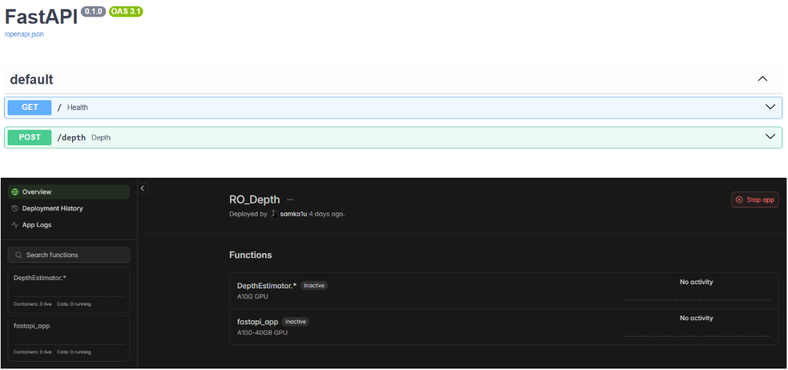

#   Ro-Fetch

A [TTU Whitacre College of Engineering](https://www.depts.ttu.edu/coe/) ECE-4380 Capstone lab project \
 

## Description

Ro-Fetch is a disability assistance robotics platform capable of reality checking and providing home security services for those with mobility issues.​

### Dependencies
* 
  
### Overview

### Hardware

#### Master controller
* Raspberry pi 5
* Logitech C310 webcam
* Respeaker Xvf3800 Mic Array
* Slamtec Rplidar C1M1 360 Laser Radar
* Lerobot So-101 Robotic Arm

#### Lower Level Controller
* ESP32 General Driver Board for Robotics 
* DC Motors

  
### Software

#### Mono-Depth Backend
* Modal Labs IaC deployment recieves image bytes of frame from Ro-Fetch and processes it with Apple Depth-Pro metric depth model. Depth endpoint then returns high precision depth array for /camera/depth/points topic.   

## Meet The Team

Samuel Kalu 
  
* Email : [samkalu@ttu.edu](mailto:samkalu@ttu.edu)
* [Linkedin](https://www.linkedin.com/in/samuel-kalu-74a359342/)

Stephen Nwosu 
* Email : [stepnwos@ttu.edu](mailto:stepnwos@ttu.edu)

## Acknowledgments

### Special thanks to Dr. Brian Nutter
Inspiration, code snippets, etc.
* [TTU WCOE ECE Department](https://www.depts.ttu.edu/ece/)

  
